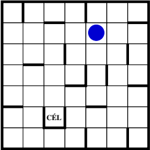

# Sliding Maze (1.7)

## About the game
The game is a single player puzzle game, with a simple (one-phase)
move selection.

## Rules
The goal of the game is to get the ball into the goal labeled cell.
The ball can be moved in 4 directions: **up, down, right, left**.
If the ball is moved in any of the directions, it moves in that direction, until it bumps into a wall.

## Solution: RIGHT, DOWN, LEFT, DOWN, LEFT, UP, LEFT, DOWN, LEFT, UP, RIGHT, UP, RIGHT, UP, LEFT, DOWN, RIGHT, DOWN